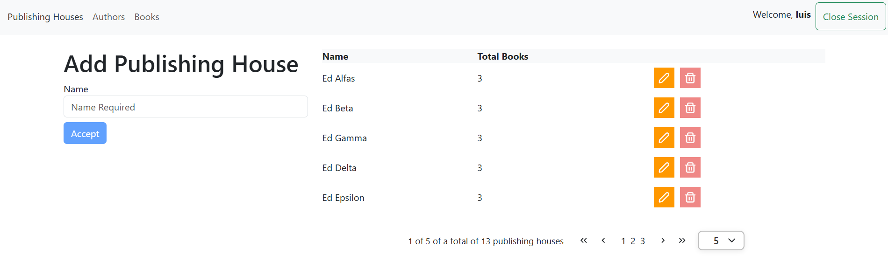
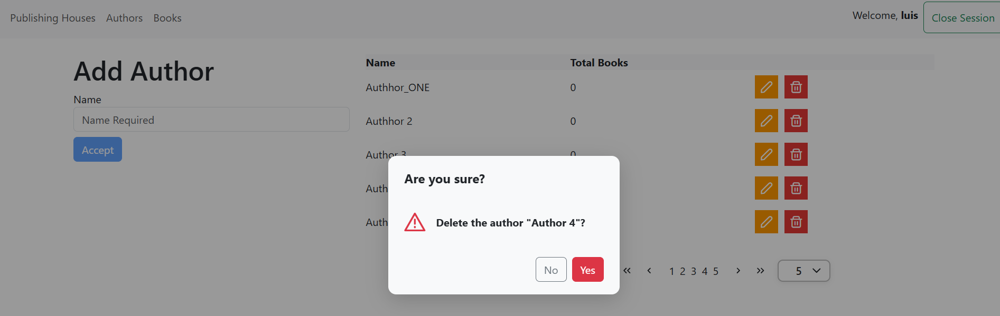
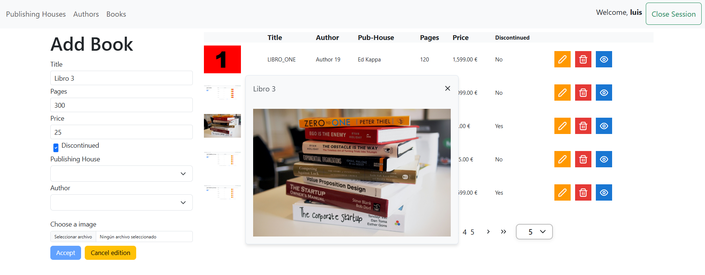

## AngularLibrary_20

**AngularLibrary_20** is a library management web application developed with Angular 20.1.2. It allows users to authenticate themselves and manage authors, publishers, and books. The application is an administration panel for managing a library's core resources (authors, publishers, and books), with a basic authentication and access protection system. It uses Bootstrap 5, PrimeNG and JWT for authentication.


AngularLibrary_20/  
├───app/  
│   ├───guards/  
│   │   └───AuthGuardService.ts  
│   ├───library/  
│   │   ├───authors/  
│   │   │   ├───AuthorsComponent.css  
│   │   │   ├───AuthorsComponent.html  
│   │   │   └───AuthorsComponent.ts  
│   │   ├───books/  
│   │   │   ├───BooksComponent.css  
│   │   │   ├───BooksComponent.html  
│   │   │   └───BooksComponent.ts  
│   │   ├───publishing-houses/  
│   │   │   ├───PublishingHousesComponent.css  
│   │   │   ├───PublishingHousesComponent.html  
│   │   │   └───PublishingHousesComponent.ts  
│   │   ├───interfaces/  
│   │   │   └───LoginInterfaces.ts  
│   │   ├───LibraryComponent.html  
│   │   ├───LibraryComponent.ts  
│   │   ├───LibraryInterface.ts  
│   │   └───LibraryService.ts  
│   ├───services/  
│   │   └───AppService.ts  
│   ├───shared/  
│   │   ├───navbar/  
│   │   │   ├───NavbarComponent.css  
│   │   │   ├───NavbarComponent.html  
│   │   │   └───NavbarComponent.ts  
│   ├───start/  
│   │   ├───login/  
│   │   │   ├───LoginComponent.css  
│   │   │   ├───LoginComponent.html  
│   │   │   └───LoginComponent.ts  
│   │   ├───not-found/  
│   │   │   ├───NotFoundComponent.css  
│   │   │   ├───NotFoundComponent.html  
│   │   │   └───NotFoundComponent.ts  
│   ├───AppComponent.css  
│   ├───AppComponent.html  
│   ├───AppComponent.ts  
├───environments/  
│   ├───EnvironmentDevelopment.ts  
│   └───Environment.ts  
├───angular.json  
└───package.json  







## environment

```
export const environment = {
  urlAPI: 'https://localhost:7157/api/',
};

```

[DeepWiki moraisLuismNet/AngularLibrary_20](https://deepwiki.com/moraisLuismNet/AngularLibrary_20)

## Development server

Run `ng serve` for a dev server. Navigate to `http://localhost:4200/`. The application will automatically reload if you change any of the source files.

## Code scaffolding

Run `ng generate component component-name` to generate a new component. You can also use `ng generate directive|pipe|service|class|guard|interface|enum|module`.

## Build

Run `ng build` to build the project. The build artifacts will be stored in the `dist/` directory.

## Running unit tests

Run `ng test` to execute the unit tests via [Karma](https://karma-runner.github.io).

## Running end-to-end tests

Run `ng e2e` to execute the end-to-end tests via a platform of your choice. To use this command, you need to first add a package that implements end-to-end testing capabilities.

## Further help

To get more help on the Angular CLI use `ng help` or go check out the [Angular CLI Overview and Command Reference](https://angular.io/cli) page.
